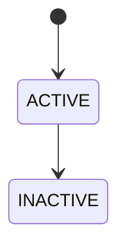

# BC-<ID> <Domain> UML 模型说明

当前事实来源：[tactical-design.md](tactical-design.md)

---

## 一、模型说明
### 1. 子域建模总览

| 子域 | 聚合根 | 实体 | 值对象 / 枚举 | 说明 |
|---|---|---|---|---|
| `<SubdomainEnglish(子域中文)>` | `<AggregateRoot>` | `<EntityA>、<EntityB>` | `<ValueObjectA>、<EnumA>` | `<说明>` |

### 2. 建模说明

| 项目 | 说明 |
|---|---|
| 聚合边界 | `<说明>` |
| 外部引用 | `<说明>` |
| 图面范围 | 本图仅保留聚合根、实体、值对象、枚举及其结构关系；服务移至 `05-architecture.md` |

---

## 二、关系说明表

| 源对象 | 目标对象 | 关系类型 | 基数 | 说明 |
|---|---|---|---|---|
| `<A>` | `<B>` | `组合/聚合/属性类型/按标识引用/依赖` | `1..1 : 0..*` | `<说明>` |

---

## 三、类图

```mermaid
classDiagram
    direction LR

    namespace <SubdomainGroup> {
        class <AggregateRoot>["<AggregateRoot>(中文名)"] {
          <<Aggregate Root>>
          +field
          +behavior()
        }

        class <Entity>["<Entity>(中文名)"] {
          <<Entity>>
          +field
        }

        class <ValueObject>["<ValueObject>(中文名)"] {
          <<Value Object>>
          +field
        }
    }

    <AggregateRoot> "1..1" *-- "0..*" <Entity>
    <AggregateRoot> "1..1" --> "0..*" <ValueObject>
```

---

## 四、事件协作图


---

## 五、状态图

若该领域不存在明确生命周期，可删除本节。


