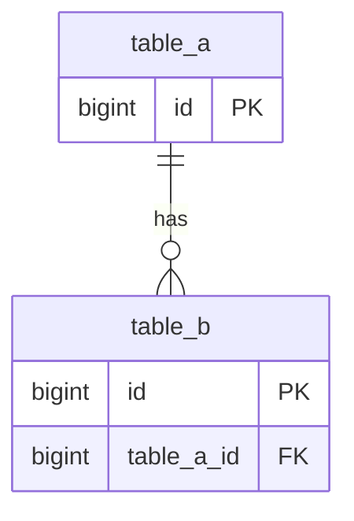

# BC-<ID> <Domain> 物理数据模型

当前事实来源：[tactical-design.md](tactical-design.md)

---

## 一、物理模型图

## 二、关系说明
| 源表 | 目标表 | 关系 | 说明 |
|---|---|---|---|
| `table_b` | `table_a` | `N:1` | `<说明>` |

## 三、核心表设计

| 表名 | 中文名称 | 用途 | 主键 | 说明 |
|---|---|---|---|---|
| `table_a` | `<中文名>` | `<用途>` | `id` | `<说明>` |

## 四、字段明细
### 1. `table_a`

| 字段名 | 类型 | 可空 | 默认值 | 约束 | 描述 |
|---|---|---|---|---|---|
| `id` | `bigint` | NO | 自增 | PK | 主键 |

## 五、索引设计
| 表名 | 索引名 | 字段 | 类型 | 用途 |
|---|---|---|---|---|
| `table_a` | `pk_table_a` | `id` | PK | 主键 |

## 六、状态与数据约束

| 编号 | 约束 | 说明 |
|---|---|---|
| PDM-001 | `<约束>` | `<说明>` |

## 七、生命周期与清理策略

| 对象 | 策略 | 说明 |
|---|---|---|
| `table_a` | `<策略>` | `<说明>` |

## 八、落库说明
| 项目 | 说明 |
|---|---|
| 主键策略 | `<说明>` |

## 九、待确认事项

| 序号 | 待确认项 | 说明 |
|---|---|---|
| 1 | `<待确认项>` | `<说明>` |
